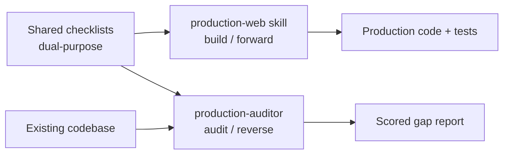
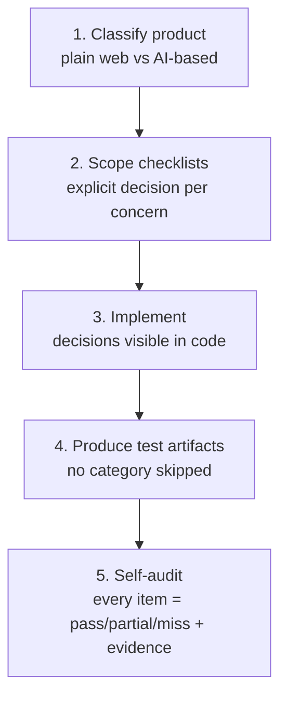

# Design — production-web standard

## Overview & goals

We want AI-assisted development to produce production-grade software by default,
instead of happy-path code that silently skips the hard, invisible parts:
throttling, error handling, input validation, pagination, caching, auth edge cases,
connection pooling, and tests.

The standard is encoded once and used in two directions:

- **Build (forward)** — the `production-web` skill gates new work through a required
  workflow, forcing explicit decisions and test artifacts.
- **Audit (reverse)** — the `production-auditor` subagent grades already-built code
  against the same standard and reports gaps with evidence and severity.

Goals:

1. **Stop silent skipping** — every production concern is either handled or
   explicitly waived with a reason.
2. **Cover AI products specifically** — evals for single tools, agents, tool↔agent
   contracts, whole pipelines, and multi-pipeline communication.
3. **One source of truth** — building and grading read the same files, so they can
   never drift.

## Architecture

Three components share one knowledge base.



Because both consumers read the same checklists, a change to the standard updates
building and grading at once.

## Enforced build workflow

The skill is a **gate**: work is not "done" until all five steps are walked and the
self-audit is produced. Skipping a concern is allowed only with a stated reason.



Step 2 forces a decision table (e.g. "throttling: token-bucket, per-user, 100/min,
429 + Retry-After") — no silent defaults. Step 5 is the deliverable that proves the
gate held: each item marked ✅ / ⚠️ / ❌ with `file:line` or a test name as evidence.

## AI testing pyramid

For AI products, tests are **eval harnesses** (cases + scorer), not exact-match
assertions, because output is non-deterministic. Five levels, each required where
the system has that layer.

| Level | What is tested | Key assertions |
|---|---|---|
| 1. Single tool | Each tool alone | valid→correct; invalid→graceful error; schema conforms; idempotency; timeout path |
| 2. Single agent | One agent's judgment | picks right tool; handles tool failure; stays in scope; step-budget guard |
| 3. Tool↔agent contract | The boundary | args match tool schema; parses output; survives malformed/partial response |
| 4. Whole pipeline | End-to-end, one pipeline | golden-path evals; regression corpus; latency + cost budget; failure recovery |
| 5. Multi-pipeline | Pipelines feeding pipelines | handoff contract; backpressure; partial-failure isolation; no cascade; correlation ids |

Cross-cutting: pin model/seed/temperature where possible (else score by threshold
over N runs); prompts are code under test; every eval run reports token + cost and
fails CI on regression; safety/refusal evals where there is a safety boundary.

## Checklist format (dual-purpose)

Every checklist item is written so both consumers use it verbatim:

- **Required (build)** — what must exist for the item to be "done". Drives the skill.
- **Audit signals / Severity** — what to look for to confirm it, and how bad if
  missing. Drives the subagent.

The five checklists: `backend-robustness`, `testing-standard`, `testing-ai`,
`frontend-quality`, `ops-readiness`.

## Repo layout & install

```
skills/production-web/   SKILL.md, workflow.md, checklists/, templates/
agents/production-auditor.md
```

Install globally (`~/.claude/`) or project-local (`.claude/`). The auditor reads the
skill's `checklists/`, so both must be installed. See the README for commands.

## How to test / verify

1. **No absolute paths:** `grep -rn "/Users/" .` returns nothing — the standard is
   portable.
2. **Frontmatter valid:** `SKILL.md` has `name` + `description`; the agent has
   `name` + `description` + `tools`.
3. **Install smoke test:** copy into `~/.claude/`; confirm the skill triggers on a
   "build a production web app" request and the subagent loads.
4. **Auditor end-to-end:** run `production-auditor` against `examples/` (or a small
   real repo); confirm it produces the scored table and stays read-only.

## Status & roadmap

First-pass content. Next passes, in priority order:

1. `testing-ai.md` — concrete eval-case examples + a reference harness scaffold.
2. `backend-robustness.md` — a decision template per concern (only rate-limiter
   exists today).
3. Deepen `frontend-quality` and `ops-readiness`.
4. Add a worked example repo under `examples/` that the auditor runs against.
